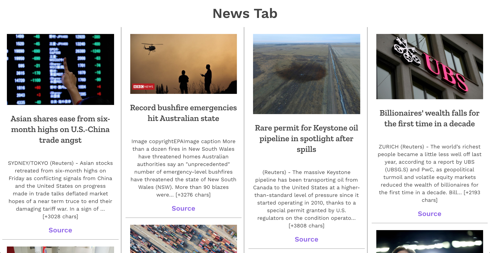

# News Tab

A Chrome extension that displays the latest headlines on your New Tab page.



## Development

Clone this repository, `cd` into it, and run `yarn install` to install the dependencies.

To see the Chrome extension in action on your local browser, follow these steps:
1. Make sure you have set up the required environment variables (see below).
2. Run the command `yarn build` to create a production build.
3. Go to `chrome://extensions` and enable _Developer Mode_. Click on _Load Unpacked_. This will bring up the file browser.
4. Find the `build/` directory of this app and select it.
5. Now, whenever you open a new tab, you should be able to see the latest headlines!

### Environment Variables

Grab your free API key from [News API](https://newsapi.org). Add the following line to your `.env` file:

```
API_KEY=<YOUR API KEY HERE>
```

Additionally, create a `.env.production` file for the production environment and add the following line:

```
INLINE_RUNTIME_CHUNK=false
```

Inline scripts are blocked by most browsers (see [Content Security Policy](https://developer.chrome.com/extensions/contentSecurityPolicy)), so this variable will help bypass this restriction by disabling scripts being added inline by react-scripts.

## Credits

This project:

1. Uses [News API](https://newsapi.org).
2. Looks great because of [Grommet](https://v2.grommet.io/).
3. Was bootstrapped with [Create React App](https://github.com/facebook/create-react-app).
